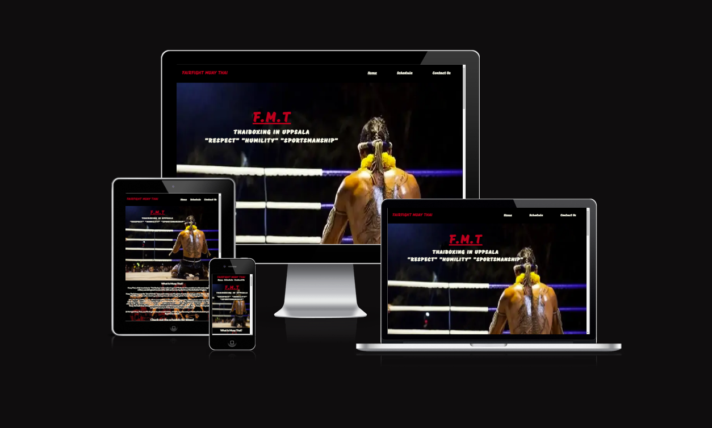

# FAIRFIGHT MUAY THAI (FMT) GYM

Developer : Mattias Lundkvist

## project overview
[Live webpage](https://mindfalls.github.io/fairfight-muay-thai/)

## Subject : 
To design and develop a dynamic and attractive website for a Muay Thai gym.

## Table of contents

1. [Project Goal](#project-goal)
    1. [User Goals](#user-goals)
    2. [Site Owner Goals](#site-owner-goals)
2. [User Experience](#user-experience)
    1. [Target Audience](#target-audience)
    2. [User Requirements and Expectations](#user-requirements-and-expectations)
    3. [User Stories](#user-stories)
3. [Design](#design)
    1. [Design Choices](#design-choices)
    2. [Colours](#colours)
    3. [Fonts](#fonts)
    4. [Structure](#structure)
    5. [Wireframes](#wireframes)
4. [Technologies Used](#technologies-used)
    1. [Languages](#languages)
    2. [Frameworks and Tools](#frameworks-and-tools)
5. [Features](#features)
6. [Testing](#testing)
    1. [HTML Validation](#HTML-validation)
    2. [CSS Validation](#CSS-validation)
    3. [Accessibility](#accessibility)
    4. [Performance](#performance)
    5. [Device testing](#performing-tests-on-various-devices)
    6. [Browser compatibility](#browser-compatibility)
    7. [Testing user stories](#testing-user-stories)
8. [Bugs](#bugs)
9. [Deployment](#deployment)
10. [Credits](#credits)
11. [Acknowledgements](#acknowledgements)

## Project goal :

The goal of this website is to attract individuals , ages six (6) and above, of different genders, with our without Muay Thai experience, and who wants to try a unique and fun way of keeping fit. The aim is to design a fully functional website that is user-friendly and can be easily accessed on all devices.

## User Experience :

- Ages 6 and up
- Anyone who is interested to learn Muay Thai and get fit
- All levels and abilities welcome

## User requirements and expectations :

- An easily navigated website.
- Links works as expected.
- Good presentation and a visually appealing design regardless of screen size.
- An easy way to contact the gym.
- Simple content that the user can skim read.

## User Stories:

### First-Time Users :

1. As a first-time user, I would like to know straight away which city the gym is located.

2. As a first-time user, I would like to know a little history and background information about Muay Thai.

3. As a first-time user, I would like to easily contact the gym for more information.

4. As a first-time user, I would like to know more about the trainers.

5. As a first-time user, I would like to be able to easily find the contact information such as phone and email and the complete address of the gym.

6. As a first-time user, I would like to see the membership prices and weekly schedules.

7. As a first-time user, I would like to be able to locate the gym easily.

### Returning Users :

8. As a returning user, I would like to be able to contact the gym easily if I need more information.

9. As a returning user, I would like to be able to see the weekly schedules and the different classes offered.

10. As a returning user, I would like to find the gym on different social media sites.

### Site Owner :

11. As a site owner, I want my users to be able to locate the gym easily.

12. As a site owner, I want my users to be able to find the gym’s contact details and complete address easily.

13. As a site owner, I would like my users to be able to contact us for more information.

14. As a site owner, I would like the membership prices, schedules, and different training classes to be readily available for our users.

15. As a site owner, I would like my users to know who our trainers are.

## Features :

#### Navigation bar

The site will provide easy access and user friendly tabs which will instantly open and will direct the user to the Homepage, the schedules, and the contact details with just one click. These will be found on the header of all pages to access the different pages without the user having to click back.

#### The Landing Page

The main page includes a photograph of a Muay Thai fighter giving his respects as part of the pre-fight ritual. It also includes a text overlay of the gym location and the three main values which the gym aims to emulate to its members.

#### Short description of Muay Thai

This section gives the user a brief history and introduction about what the sport is all about and all this information is provided as a text overlay. It includes a photograph of the traditional Muay Thai techniques.
Also included is a link to the schedules.

#### The Trainers

The user can find the name and photo of the trainers with brief introductions about their Muay Thai experiences.

#### Map

The user is provided with an interactive map which points out the exact location of the gym. This is very helpful especially for first time users who are not familiar with the gym location.

#### Footer

The user is provided with the different relevant social media platforms, which when clicked, will open to a new tab. This will make the navigation easier for the user.

Also included is th contact information such as the phone number, email address, and the physical address.

#### Schedule 

The user is provided a table showing the various training times and days of the week and for which levels or classes.

#### Classes

This shows the user the different types of Muay Thai classes provided in the gym. Under each class is a short description that gives the user an idea what to expect and who are included in those classes.

#### Membership prices

Here, the user can see some of the different membership prices provided as well as a link to the contact details for more information regarding price and payment options.

#### Contact Us

This provides an easy way of getting in touch with the gym by filling out the online form with the relevant information needed and clicking "Submit" to send the message.

#### Additional Photo section 

Just below the "Send us a message" part is an additional photograph showing some of the trainers in their victory pose.

## Design

### Layout

I specifically chose this simple yet slick lay out because it matches the theme of the gym, simple, very straightforward and all about Muay Thai.

### Colours

The name itself, Fairfight Muay Thai gym, focuses only on Muay Thai so all the colours I used are those that are heavily connected to the sport.

I went with a black and white background because it symbolizes fairness and equality in sports and the new official fights have introduced black and white corners in the ring instead of the red and blue corners. 

This colour combination is also very easy on the eyes.

Red is a very prominent and fierce colour that is very commonly used in Muay Thai. On black background, it stands out more which is perfect for the title.

Blue is another dominant colour used in Muay Thai and it is also very subtle and soft on the eyes. 

I also added the Golden Rod colour which works well with the dark background.

Additional colours used are for the social media icons in the site.

The specific colours I used on the site are as follows:

1.	Black: black
2.	White: #FFFFF0
3.	Red: #c50822
4.	Blue: #1475e4
5.	Golden Rod: goldenrod
6.  Facebook blue icon: #3b5998
7.	Instagram purple icon: #962fbf
8.	Twitter blue icon: #1475e4

All colours were taken from HTML color picker(https://www.w3schools.com/colors/colors_picker.asp) and I tested them several times before settling for the right shade.

## Testing :

The WC3C Markup Validation Service was used to test and validate teh HTML and CSS of the website.

## HTML Validation :

All tests returned no errors

index : [Link](https://validator.w3.org/nu/?doc=https%3A%2F%2Fmindfalls.github.io%2Ffairfight-muay-thai%2F)

Schedule : [Link](https://validator.w3.org/nu/?doc=https%3A%2F%2Fmindfalls.github.io%2Ffairfight-muay-thai%2Fschedule.html)

Contact : [Link](https://validator.w3.org/nu/?doc=https%3A%2F%2Fmindfalls.github.io%2Ffairfight-muay-thai%2Fcontact.html)

## CSS Validation :

All tests returned no errors

Index : [Link](https://jigsaw.w3.org/css-validator/validator?uri=https%3A%2F%2Fmindfalls.github.io%2Ffairfight-muay-thai%2Findex.html&profile=css3svg&usermedium=all&warning=1&vextwarning=&lang=en)

Schedule : [Link](https://jigsaw.w3.org/css-validator/validator?uri=https%3A%2F%2Fmindfalls.github.io%2Ffairfight-muay-thai%2Fschedule.html&profile=css3svg&usermedium=all&warning=1&vextwarning=&lang=en)

Contact : [Link](https://jigsaw.w3.org/css-validator/validator?uri=https%3A%2F%2Fmindfalls.github.io%2Ffairfight-muay-thai%2Fcontact.html&profile=css3svg&usermedium=all&warning=1&vextwarning=&lang=en)

## WAVE Web accessibility testing :

All tests returned no errors

Index : [Link](https://wave.webaim.org/report#/https://mindfalls.github.io/fairfight-muay-thai/)

Schedule : [Link](https://wave.webaim.org/report#/https://mindfalls.github.io/fairfight-muay-thai/schedule.html)

Contact : [Link](https://wave.webaim.org/report#/https://mindfalls.github.io/fairfight-muay-thai/contact.html)

## Performance
Google Lighthouse in Google Chrome Developer Tools was used to test the performance of the website. All aspects performing well.

index : 

schedule : 

contact : 

## Deployment :

The website was deployed using GitHub Pages by following these steps:

1. In the GitHub repository navigate to the Settings tab
2. On the left-hand menu select Pages
3. For the source select Branch: master
4. After the webpage refreshes automatically you will see a ribbon on the top saying: Your site is live at

https://mindfalls.github.io/fairfight-muay-thai/

## Credits

- Text contents for the Short description of Muay Thai including photograph was taken from 
https://eu.yokkao.com/pages/what-is-muay-thai 

- Media

¤ All other photos used in the website are owned by Athit and Sandra Praditphon

